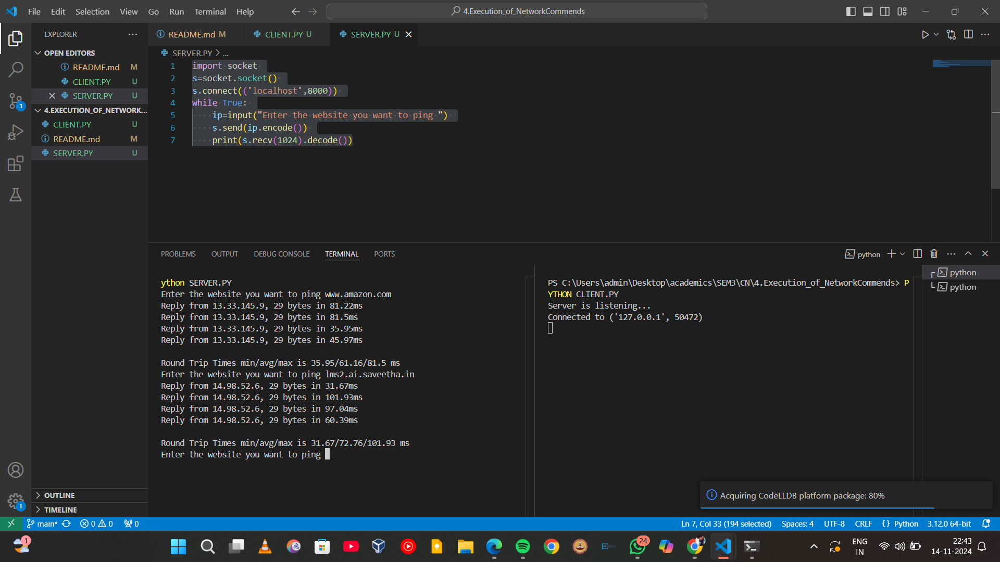
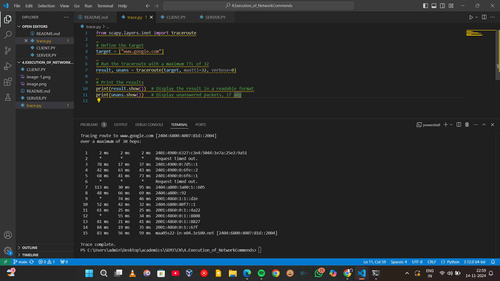

# 4.Execution_of_NetworkCommands
**Name:** Keerthana Saravanan
**Register Number:** 212223240070
## AIM :Use of Network commands in Real Time environment
## Software : 
Command Prompt And Network Protocol Analyzer
## Procedure: 
To do this EXPERIMENT- follows these steps:
<BR>
In this EXPERIMENT- students have to understand basic networking commands e.g cpdump, netstat, ifconfig, nslookup ,traceroute and also Capture ping and traceroute PDUs using a network protocol analyzer 
<BR>
All commands related to Network configuration which includes how to switch to privilege mode
<BR>
and normal mode and how to configure router interface and how to save this configuration to
<BR>
flash memory or permanent memory.
<BR>
This commands includes
<BR>
• Configuring the Router commands
<BR>
• General Commands to configure network
<BR>
• Privileged Mode commands of a router 
<BR>
• Router Processes & Statistics
<BR>
• IP Commands
<BR>
• Other IP Commands e.g. show ip route etc.
<BR>
## Program:
### CLIENT:
```
import socket
from pythonping import ping

# Initialize the socket
s = socket.socket()
s.bind(('localhost', 8000))  # Missing comma was causing syntax error
s.listen(5)
print("Server is listening...")

# Accept a client connection
c, addr = s.accept()
print(f"Connected to {addr}")

while True:
    try:
        # Receive the hostname from the client
        hostname = c.recv(1024).decode()

        if not hostname:
            break  # Break if no hostname is received (client disconnected)

        # Attempt to ping the received hostname
        response = ping(hostname, verbose=False)
        c.send(str(response).encode())
    except KeyError:
        # Send "Not Found" if the hostname is invalid or an error occurs
        c.send("Not Found".encode())
    except Exception as e:
        # Catch any unexpected errors
        print(f"Error: {e}")
        c.send(f"Error: {str(e)}".encode())

# Close the socket connection
c.close()
s.close()

```

### SERVER:
```
import socket 
s=socket.socket() 
s.connect(('localhost',8000)) 
while True: 
ip=input("Enter the website you want to ping ") 
s.send(ip.encode()) 
print(s.recv(1024).decode())
```
### TRACEROUTE COMMAND:
```
 from scapy.all import*     
target = ["www.google.com"]     
result, unans = traceroute(target,maxttl=32) 
print(result,unans)
```
## Output


## Result
Thus Execution of Network commands Performed 
